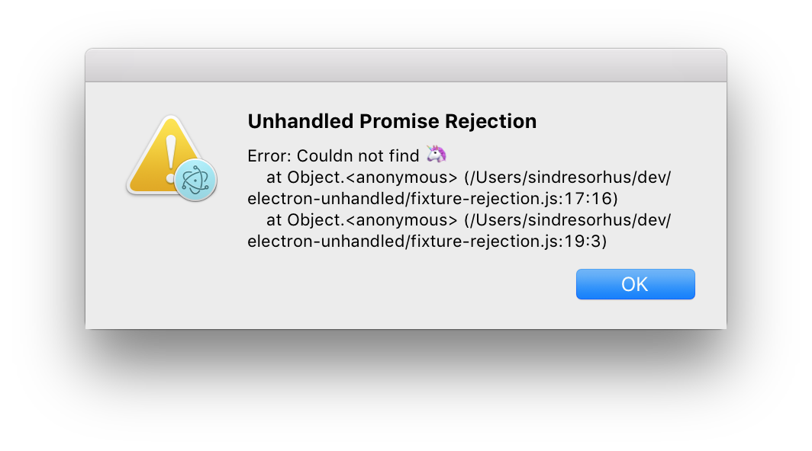

# electron-unhandled [](https://travis-ci.org/sindresorhus/electron-unhandled)

> Catch unhandled errors and promise rejections in your [Electron](https://electronjs.org) app

You can use this module directly in both the main and renderer process.


## Install

```
$ npm install electron-unhandled
```


## Usage

```js
const unhandled = require('electron-unhandled');

unhandled();
```


## API

### unhandled([options])

You probably want to call this both in the main process and any renderer processes to catch all possible errors.

### options

Type: `Object`

#### logger

Type: `Function`<br>
Default: `console.error`

Custom logger that receives the error.

Can be useful if you for example integrate with Sentry.

#### showDialog

Type: `boolean`<br>
Default: [Only in production](https://github.com/sindresorhus/electron-is-dev)

Present an error dialog to the user.




## Related

- [electron-store](https://github.com/sindresorhus/electron-store) - Save and load data like user preferences, app state, cache, etc
- [electron-debug](https://github.com/sindresorhus/electron-debug) - Adds useful debug features to your Electron app
- [electron-context-menu](https://github.com/sindresorhus/electron-context-menu) - Context menu for your Electron app
- [electron-dl](https://github.com/sindresorhus/electron-dl) - Simplified file downloads for your Electron app


## License

MIT © [Sindre Sorhus](https://sindresorhus.com)
